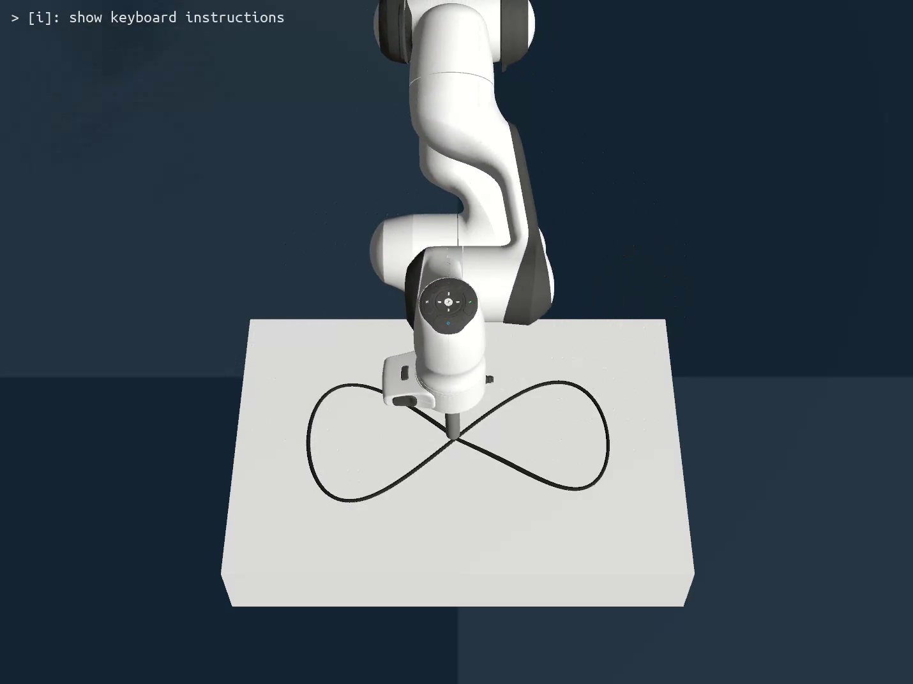
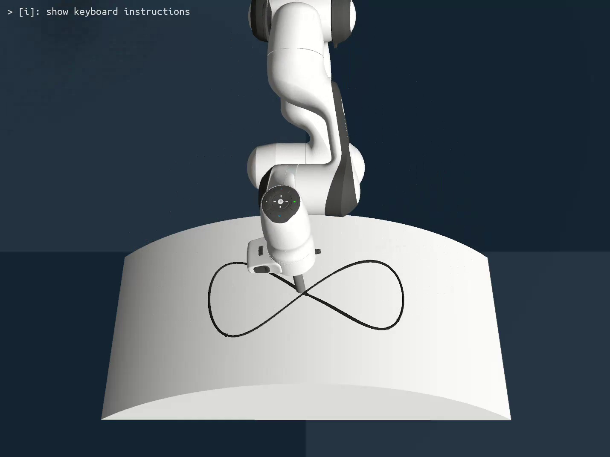

# Motion Force Control of Franka Robot Arm Based on Genesis Simulation

<p align="center">
  
  &nbsp;&nbsp;&nbsp;&nbsp;
  
</p>

## Overview

This is a course project for ARCL (Advanced Robot Control and Learning). This repo focused on decoupled force and motion control.

This repository implemented a simple gym style environment of franka emika panda simulated with Genesis. 

The controllers included methods from paper "Hybrid Force-Impedance Control for Fast End-Effector Motions" and "Partially Decoupled Impedance Motion Force Control Using Prioritized Inertia Shaping".

## Installation

### Prerequisites

Install [Pixi](https://pixi.sh) if you don't have it already.

```bash
curl -fsSL https://pixi.sh/install.sh | sh
```

### One-line installation & activation

Clone this repository and run:

```bash
pixi shell
```
## Controllers
### Cartesian Impedance controller
Default cartesian impedance controller.
```bash
python scripts/sim.py -e default -c imp
python scripts/sim.py -e box -c imp
python scripts/sim.py -e surface -c imp
```
### Motion Force Controller
Cartesian impedance controller with explicit force PD control.
```bash
python scripts/sim.py -e box -c mfc
python scripts/sim.py -e surface -c mfc
```
### Hybrid Force Impedance Controller
Implementation of the HFIC paper, compensates motion generated theoretical force.
```bash
python scripts/sim.py -e box -c hfic
python scripts/sim.py -e surface -c hfic
```
### Partial Decoupled Impedance Motion Force Controller.
Implementation of the PD-IMFC paper, shapes partial decoupled inertia.
```bash
python scripts/sim.py -e box -c pdimfc
python scripts/sim.py -e surface -c pdimfc
```


